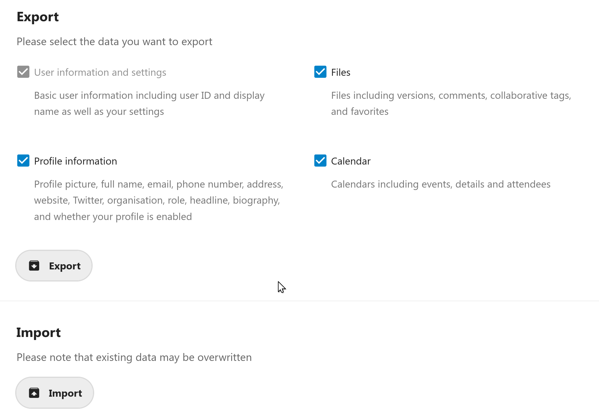
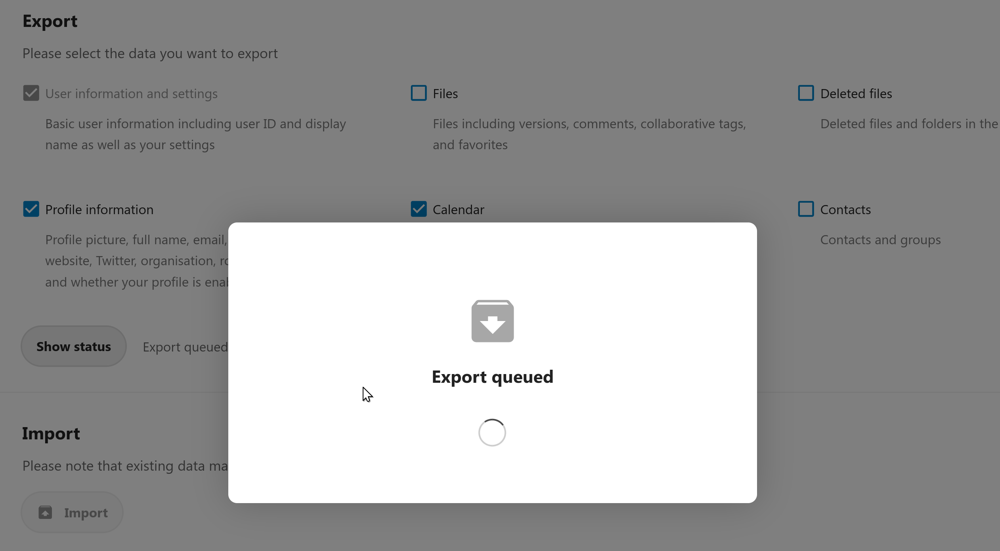
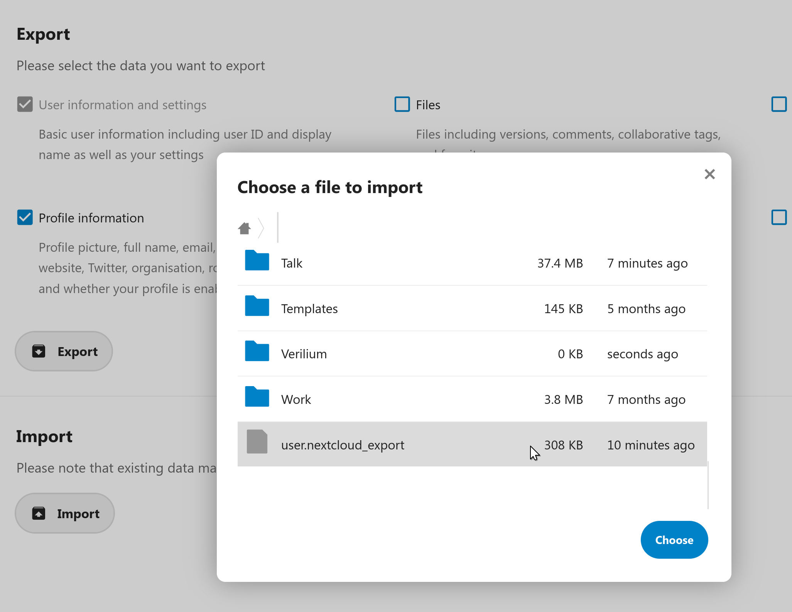

# Nextcloud User migration

**👤➡ User migration app for Nextcloud**

This app allows users to easily migrate from one instance to another using an export of their account.

- **🐱 Log in to cat.example.com/nextcloud**
- **⚙ Go into `Personal settings` > `Data migration`**
- **☑ Select what you want to export** (settings, files, profile information, profile picture, calendars, contacts…)
- **⚙ Start the export** and wait for the server to process it
- **📁 Download the resulting file called `user.nextcloud_export`**
- **🐶 Open an account on dog.example.com/nextcloud**
- **🡅 Upload `user.nextcloud_export` into your files**
- **⚙ Go into `Personal settings` > `Data migration` and start the import**
- **🎉 Enjoy your stay on your new instance** and close you old account

---

## Screenshots

### Select what to export from your old instance

### Export in progress

### Import into your new instance

